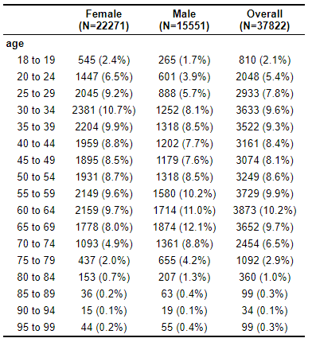
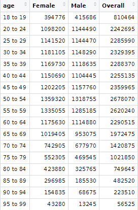
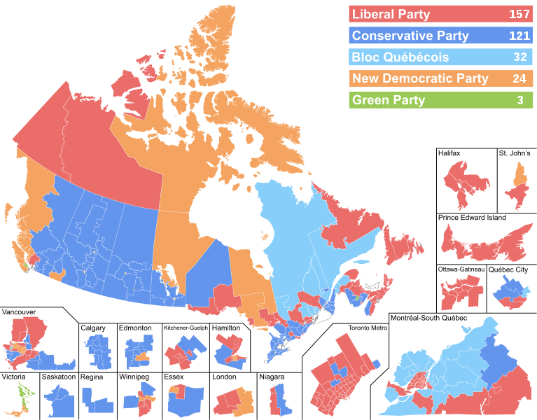

The code for this paper is located at the following repository: https://github.com/valuemeta/STA304-Final. The data is located separately and can be found from the CES website and Statistics Canada. 

# Abstract

Multilevel Models with Poststratification (MRPs) are being used frequently in forecasting election results. We seek to apply these models instead to past elections to gain insight into the election results if every eligible person had voted. Specifically, the 2019 Canadian election will be explored, using data from the CES 2019 Web Survey to fit our model and the Canadian Census to poststratify. A frequentist logistic multilevel model with random intercepts for each riding is used to predict the proportion of people who vote for each of the 5 parties in Canada that won seats in the House of Commons in the election. The results of the analysis would be used to justify or reject the idea that everybody's vote matters.

# Introduction

Eligible voters in Canada are encouraged to go out and vote in all elections. They are constantly told that their vote matters and changes the country for the next few years. This paper will focus on examining if there is indeed a change in the number of seats that a political party has in the House of Commons if every person in Canada had voted during the 2019 Canadian election. These results are important because the truth of one of the basic principles of democracy would depend on them.

A popular method of predicting political results are MRP models. MRP models will be used in this paper to predict which seats go to which party for each of the Canadian federal electoral districts. The results of the MRP models will be compared to the actual results of the 2019 Canadian election to determine the change in seats for each of the political parties. In addition, further investigation will be conducted on which federal electoral districts changed political party due to the extra voter turnout.

Two datasets will be used to conduct the analysis in this paper. They consist of a sample dataset containing information about political leanings of individuals in Canada as well as a few other variables, and another more representative dataset that is missing political information. The Methodology section elaborates further on the 2 datasets used, as well as the MRP models in-depth. The results of the model are placed in the Results section. Conclusions drawn from these results are located in the Conclusion Section.

# Keywords

MRP,Poststratification,Multilevel Model,Canadian Politics,Frequentist,Logistic Regression

```{r include = FALSE}
# The setup code chunk

# These are the packages that will need to be installed
# install.packages("devtools")
# devtools::install_github("hodgettsp/cesR")
# install.packages("lme4")
# library(devtools)
# install_github("mccormackandrew/mapcan", build_vignettes = TRUE)
# install.packages("broom.mixed")
# install.packages("MuMIn")

# Libraries imported
library(cesR)
library(tidyverse)
library(lme4)
library(table1)
library(mapcan)
library(broom.mixed)
library(MuMIn)

# Need to grab the CES 2019 Web data
get_ces("ces2019_web")
```

```{r include = FALSE}
# Make a new variable to store the CES 2019 web data
sample <- ces2019_web

# Clean the sample data and make some indicator variables for voting
sample <- sample %>%
  mutate(vote_liberal = ifelse(cps19_votechoice == 1, 1, 0)) %>%
  mutate(vote_conservative = ifelse(cps19_votechoice == 2, 1, 0)) %>%
  mutate(vote_bloc = ifelse(cps19_votechoice == 4, 1, 0)) %>%
  mutate(vote_NDP = ifelse(cps19_votechoice == 3, 1, 0)) %>%
  mutate(vote_green = ifelse(cps19_votechoice == 5, 1, 0)) %>%
  mutate(age = case_when(
    cps19_age <= 19 ~ "18 to 19",
    cps19_age <= 24 ~ "20 to 24",
    cps19_age <= 29 ~ "25 to 29",
    cps19_age <= 34 ~ "30 to 34",
    cps19_age <= 39 ~ "35 to 39",
    cps19_age <= 44 ~ "40 to 44",
    cps19_age <= 49 ~ "45 to 49",
    cps19_age <= 54 ~ "50 to 54",
    cps19_age <= 59 ~ "55 to 59",
    cps19_age <= 64 ~ "60 to 64",
    cps19_age <= 69 ~ "65 to 69",
    cps19_age <= 74 ~ "70 to 74",
    cps19_age <= 79 ~ "75 to 79",
    cps19_age <= 84 ~ "80 to 84",
    cps19_age <= 89 ~ "85 to 89",
    cps19_age <= 94 ~ "90 to 94",
    cps19_age <= 99 ~ "95 to 99",
    cps19_age >= 100 ~ "100 or more"
  )) %>%
  mutate(sex = case_when(
    cps19_gender == 1 ~ "Male",
    cps19_gender == 2 ~ "Female",
    cps19_gender == 3 ~ "Female"
  )) %>%
  select(age, sex, constituencynumber, vote_liberal, vote_conservative, vote_bloc, vote_NDP, vote_green)

sample$constituencynumber <- as.character(sample$constituencynumber)

# Create some models
# Models using random intercepts
liberal_model <- glmer(vote_liberal ~ age + sex + (1 | constituencynumber),
               data = sample,
               family = binomial,
               nAGQ = 0)
summary(liberal_model)

conservative_model <- glmer(vote_conservative ~ age + sex + (1 | constituencynumber),
               data = sample,
               family = binomial,
               nAGQ = 0)
summary(conservative_model)

bloc_model <- glmer(vote_bloc ~ age + sex + (1 | constituencynumber),
               data = sample,
               family = binomial,
               nAGQ = 0)
summary(bloc_model)

NDP_model <- glmer(vote_NDP ~ age + sex + (1 | constituencynumber),
               data = sample,
               family = binomial,
               nAGQ = 0)
summary(NDP_model)

green_model <- glmer(vote_green ~ age + sex + (1 | constituencynumber),
               data = sample,
               family = binomial,
               nAGQ = 0)
summary(green_model)
```

```{r include = FALSE}

census <- read_csv("98-401-X2016045_English_CSV_data.csv")
census_meta <- read_csv("Geo_starting_row_CSV.csv")
```

```{r include = FALSE}
# Post stratification

# Clean metadata (remove all the non-federal electoral districts)
census_meta <- census_meta[-c(1,2,10,15,27,38,117,239,254,269,304,347,349,351), ]

# Riding win count for each party
ridings <- rep(0,5)

simulated_results <- data.frame(party = character(),
                                riding_code = integer())

# Do this for each riding
for (row in 1:nrow(census_meta)) {
  
  # Find the location of the census data for the given riding
  
  
  # IDs of age brackets
  # 14*-23 + 25-28 + 30-33
  #* 14 needs adjusting since its 15-19 bracket
  # 18 brackets total
  
  # Subtract 2 from ID to get row adjustment to the line number in meta
  
  # Find the line adjustment
  adjustment <- census_meta$`Line Number`[row]
  
  # Put the values into a dataframe
  census_post <- data.frame(sex = c(rep("Male", 17), rep("Female", 17)),
                            age = rep(c("18 to 19",
                                        "20 to 24",
                                        "25 to 29",
                                        "30 to 34",
                                        "35 to 39",
                                        "40 to 44",
                                        "45 to 49",
                                        "50 to 54",
                                        "55 to 59",
                                        "60 to 64",
                                        "65 to 69",
                                        "70 to 74",
                                        "75 to 79",
                                        "80 to 84",
                                        "85 to 89",
                                        "90 to 94",
                                        "95 to 99"), 2),
                            constituencynumber = rep(census_meta$`Geo Code`[row], 17 * 2),
                            n = c(as.integer(census$`Dim: Sex (3): Member ID: [2]: Male`[adjustment + 12]) * 0.4,
                                  census$`Dim: Sex (3): Member ID: [2]: Male`[adjustment + c(13:21, 23:26, 28:30)],
                                  as.integer(census$`Dim: Sex (3): Member ID: [3]: Female`[adjustment + 12]) * 0.4,
                                  census$`Dim: Sex (3): Member ID: [3]: Female`[adjustment + c(13:21, 23:26, 28:30)]))
  
  # Adjust n column to be numeric
  census_post$n <- as.numeric(census_post$n)
  
  
  # Perform the post stratification procedure for each party
  
  # Liberal
  census_post$logodds_estimate <- liberal_model %>%
    predict(newdata = census_post)
  
  census_post$estimate <- exp(census_post$logodds_estimate)/(1+exp(census_post$logodds_estimate))
  
  liberal_prop <- census_post %>%
  mutate(alp_predict_prop = estimate*n) %>%
  summarise(alp_predict = sum(alp_predict_prop)/sum(n))
  
  liberal_prop <- as.numeric(liberal_prop)
  
  # Conservative
  census_post$logodds_estimate <- conservative_model %>%
    predict(newdata = census_post)
  
  census_post$estimate <- exp(census_post$logodds_estimate)/(1+exp(census_post$logodds_estimate))
  
  conservative_prop <- census_post %>%
  mutate(alp_predict_prop = estimate*n) %>%
  summarise(alp_predict = sum(alp_predict_prop)/sum(n))
  
  conservative_prop <- as.numeric(conservative_prop)
  
  # Bloc
  census_post$logodds_estimate <- bloc_model %>%
    predict(newdata = census_post)
  
  census_post$estimate <- exp(census_post$logodds_estimate)/(1+exp(census_post$logodds_estimate))
  
  bloc_prop <- census_post %>%
  mutate(alp_predict_prop = estimate*n) %>%
  summarise(alp_predict = sum(alp_predict_prop)/sum(n))
  
  bloc_prop <- as.numeric(bloc_prop)
  
  # NDP
  census_post$logodds_estimate <- NDP_model %>%
    predict(newdata = census_post)
  
  census_post$estimate <- exp(census_post$logodds_estimate)/(1+exp(census_post$logodds_estimate))
  
  NDP_prop <- census_post %>%
  mutate(alp_predict_prop = estimate*n) %>%
  summarise(alp_predict = sum(alp_predict_prop)/sum(n))
  
  NDP_prop <- as.numeric(NDP_prop)
  
  # Green
  census_post$logodds_estimate <- green_model %>%
    predict(newdata = census_post)
  
  census_post$estimate <- exp(census_post$logodds_estimate)/(1+exp(census_post$logodds_estimate))
  
  green_prop <- census_post %>%
  mutate(alp_predict_prop = estimate*n) %>%
  summarise(alp_predict = sum(alp_predict_prop)/sum(n))
  
  green_prop <- as.numeric(green_prop)
  
  # Find which party won the riding and add to the riding wins count
  ridings[which.max(c(liberal_prop, conservative_prop, bloc_prop, NDP_prop, green_prop))] <- ridings[which.max(c(liberal_prop, conservative_prop, bloc_prop, NDP_prop, green_prop))] + 1
  
  # Add results to simulated results
  if (which.max(c(liberal_prop, conservative_prop, bloc_prop, NDP_prop, green_prop)) == 1) {
    simulated_results <- rbind(simulated_results, c("Liberal", census_meta$`Geo Code`[row]))
  } else if (which.max(c(liberal_prop, conservative_prop, bloc_prop, NDP_prop, green_prop)) == 2) {
    simulated_results <- rbind(simulated_results, c("Conservative", census_meta$`Geo Code`[row]))
  } else if (which.max(c(liberal_prop, conservative_prop, bloc_prop, NDP_prop, green_prop)) == 3) {
    simulated_results <- rbind(simulated_results, c("Bloc", census_meta$`Geo Code`[row]))
  } else if (which.max(c(liberal_prop, conservative_prop, bloc_prop, NDP_prop, green_prop)) == 4) {
    simulated_results <- rbind(simulated_results, c("NDP", census_meta$`Geo Code`[row]))
  } else if (which.max(c(liberal_prop, conservative_prop, bloc_prop, NDP_prop, green_prop)) == 5) {
    simulated_results <- rbind(simulated_results, c("Green", census_meta$`Geo Code`[row]))
  }
  
}

# Change the names
simulated_results <- simulated_results %>%
  rename(party = X.Liberal.,
         riding_code = X.10001.)

simulated_results$riding_code <- as.numeric(simulated_results$riding_code)
```

# Methodology

Data:

Table 1.
```{r include = FALSE}
tableOne <- table1(~ age | sex, data = sample)
```
\

\newpage

Table 2.
```{r echo = FALSE}
# Line adjustment
adjustment <- 2
  
# Put the values into a dataframe
table2 <- data.frame(age = c("18 to 19",
                                      "20 to 24",
                                      "25 to 29",
                                      "30 to 34",
                                      "35 to 39",
                                      "40 to 44",
                                      "45 to 49",
                                      "50 to 54",
                                      "55 to 59",
                                      "60 to 64",
                                      "65 to 69",
                                      "70 to 74",
                                      "75 to 79",
                                      "80 to 84",
                                      "85 to 89",
                                      "90 to 94",
                                      "95 to 99"),
                         Female = c(as.integer(census$`Dim: Sex (3): Member ID: [3]: Female`[adjustment + 12]) * 0.4,
                                  census$`Dim: Sex (3): Member ID: [3]: Female`[adjustment + c(13:21, 23:26, 28:30)]),
                          Male = c(as.integer(census$`Dim: Sex (3): Member ID: [2]: Male`[adjustment + 12]) * 0.4,
                                  census$`Dim: Sex (3): Member ID: [2]: Male`[adjustment + c(13:21, 23:26, 28:30)]),
                     Overall = c(as.integer(census$`Dim: Sex (3): Member ID: [1]: Total - Sex`[adjustment + 12]) * 0.4,
                                  census$`Dim: Sex (3): Member ID: [1]: Total - Sex`[adjustment + c(13:21, 23:26, 28:30)]))
  
# Adjust columns to be numeric
table2$Male <- as.numeric(table2$Male)
table2$Female <- as.numeric(table2$Female)
```
\

The sample dataset from the CES 2019 Web Survey is summarized by Table 1. The 2016 Canadian Census dataset that was used for poststratification is summarized in Table 2. The datasets are recorded 3 years apart. In Table 1, it is important to note that the number of female respondents is far larger than the number of male respondents, even though the authors intended to make it a 50/50 split. Meanwhile in Table 2, the number of respondents of both sexes is about equal. In addition, Table 1 shows us that the distribution of females and males surveyed is not the same, 30-34 aged females respond the most within their sex category whereas 65-69 aged males responded the most within their sex category. From Table 2, we can see that the 50-54 age bracket contains the most amount of people, which is different from the data in Table 1.

Model:

The model is a logistic multilevel model with 2 predictor variables and a random intercept. We generate 5 models, one for each political party in Canada that won seats in the 2019 election. Our independent variables are sex and age, and we are predicting the probability of voting within a federal district.

The individual level equation is $log(\frac{Y_{ij}}{1 - Y_{ij}}) = \beta_{0j} + \sum_{k=1}^{16} \beta_k X_{ij,k} + \beta_{male}X_{ij,male} + r_{ij}$. $Y_{ij}$ refers to the probability of voting for the specified party which implies that $log(\frac{Y_{ij}}{1 - Y_{ij}})$ are the log-odds of voting for the specified party. $\beta_{0j}$ is the intercept of the $j$th district. $\beta_k$ is the slope of the relationship between age brackets and the log-odds of voting for the given party, within the $j$th district, with respect to the smallest age bracket (18 to 19 years old). $\beta_{male}$ is the difference in the log-odds of voting for a given party between male and female voters. $r_{ij}$ is the error term. $X_{ij,k}$ are indicator variables that denote the age bracket category of the observation. Thus, at most only one of these terms are non-zero. $X_{ij,male}$ is the indicator variable that is $1$ if the observation is male, and $0$ otherwise.

The district level equation is $\beta_{0j} = r_{00} + r_{01}W_{j} + u_{0j}$. $r_{00}$ is the overall intercept, which is the mean of all the log-odds of voting for the specified party across all districts for females of 18 to 19 years of age. $r_{01}$ is the slope between the log-odds of voting for the given party and the $j$th district. $W_{j}$ is an indicator variable that is $1$ if the observation is located in the $j$th district and $0$ otherwise. $u_{0j}$ is the error term.

# Results

We found that our model predicts that the Liberal Party would win 164 seats, the Conservative Party would win 141 seats, the Bloc Québécois would win 21 seats, the NDP would win 11 seats and the Green Party would win a single seat. In comparison, the actual results of the election were that the Liberal Party would win 157 seats, the Conservative Party would win 121 seats, the Bloc Québécois would win 32 seats, the NDP would win 24 seats, and the Green Party would win 3 seats [12]. Thus, the difference that occurred when everybody in the country voted was that the Liberal Party would gain 7 seats, the Conservative Part would gain 20 seats, the Bloc Québécois would lose 11 seats, the NDP would lose 13 seats, and the Green Party would lose 2 seats. Notice that in the actual election, one of the seats was not from any of the 5 big parties, which we have not accounted for in the models.



```{r echo = FALSE}
canada_map <- mapcan(boundaries = ridings, type = standard, province = all, territories = TRUE)

simulated_data <- inner_join(simulated_results, canada_map, by = "riding_code")

ggplot(data = simulated_data, aes(x = long, y = lat, group = group, fill = party)) + geom_polygon() + coord_fixed() + theme_mapcan() + scale_fill_manual(name = "Winning party",
                                                                                                                                                         values = c("lightblue", "blue", "springgreen3", "red", "orange")) + labs(caption = "Figure 2") +
  ggtitle("Predicted election results by district") +
  theme(plot.title = element_text(hjust = 0.5))
```
The summaries for the actual models are too lengthy to display in this section, but are located in the Appendix. Our models have two kinds of $R^2$ [11]. The marginal $R^2$ is the proportion of variance of the data explained by the fixed effects of the model, whereas the conditional $R^2$ is the proportion of variance of the data explained by the combined fixed and random effects of the model.

The liberal model does not have many statistically significant coefficients, and has very poor $R^2$ values using both the delta and theoretical methods of computing $R^2$ for random intercept logistic models. However, it and all the other models do significantly increase their $R^2$ when we factor in the random effects. In the conservative model, we have most of our coefficients are statistically significant at the $5%$ significance level. Also, we have a much better fit to the sample data than in the liberal case as the conditional $R^2$ is $0.184$ or $0.130$ depending on the computation method chosen. In the Bloc Québécois model, many of the coefficients are statistically significant, and we have an extremely good fit as the conditional $R^2$ is $0.851$ or $0.777$ depending on the computation method chosen. In the NDP model, most of our coefficients are statistically significant, and we have an $R^2$ of $0.160$ or $0.070$ depending on the computation method chosen. In the Green model, most of our coefficients are statistically significant, and we have an $R^2$ of $0.102$ or $0.027$ depending on the computation method chosen.


# Discussion

Summary:

In this paper we created 5 random intercept logistic models to predict the party who wins ridings across Canada. We used 5 models to account for the fact that some of the people in our sample would not respond to the vote choice question. By making models for each party, we can find the party with the highest proportion of votes in any given riding, which allows us to determine a winner. A post-stratification process on these models fitted to the sample data to obtain the number of seats won for each party if everyone eligible had voted in the election.


Conclusions:

We find that sex and age bracket are somewhat statistically significant in determining who people will vote for. However, they do not explain much of the variation of the data, so more predictors would be necessary to generate a good statistical model for vote predictions. Despite this, we found that most ridings did not flip to other parties. This hints that the election is mainly determined by a few ridings that are competitive. Everyone's vote indeed counts in these competitive ridings. However, for ridings where it is not so competitive, adding everybody's vote does not change the outcome of the election. For example, most of the ridings in Quebec that were won by the Bloc were still won by the Bloc even after post-stratification.

In terms of the global impacts, the idea that everyone's vote counts, seems to falter in regions where ridings are not competitive. If a riding is significantly Liberal for example, there aren't enough people from other parties to outnumber the Liberals. This is an artifact of having first past the post voting (FPTP). The main problem is that there are wasted votes, that don't count towards the party that lost the riding but possibly received a large amount of votes still, which means the backing in that riding is still significant. This leads to misrepresentation of the support for parties in Canada in the House of Commons. Our result is that FPTP voting in Canada leads to smaller parties having less support if everyone votes.

Weakness & Next Steps:

The census dataset from Statistics Canada has some significant flaws. Firstly, the data is from 2016, which is 3 years apart from 2019 (which is when our sample dataset was procured). In addition, due to Canadian law, the census data is not available on a per observation basis. The variables are only available with summarized data, with each variable and sex distributions, but not distributions across variables. This means we can only select 1 variable apart from sex to use in our analysis, which significantly limits the scope and the models we can use. This is why the models' $R^2$ is low.

If a more recent post stratification dataset with observation by observation results is created, this problem can be solved and the analysis can be recreated using that dataset, but with the models updated to include many different variables to predict the votes in a riding for each party. Further analysis can be carried out on other elections as well, to get a more conclusive idea about how FPTP negatively impacts smaller parties when everyone's votes are counted. Looking at other countries who use a different method of determining winners in elections such as Australia's ranking system will be useful to compare FPTP and other systems to see which one is better in what way, and the trade offs.

# References

1. Stephenson, Laura B; Harell, Allison; Rubenson, Daniel; Loewen, Peter John, 2020, "2019 Canadian Election Study - Online Survey", https://doi.org/10.7910/DVN/DUS88V, Harvard Dataverse, V1

2. Statistics Canada. (2018). 2016 Census of Population for various levels of geography, including provinces and territories, census metropolitan areas, communities and census tracts. (Catalogue number 98-316-X2016001). Retrieved December 18, 2020 from Statistics Canada: https://www12.statcan.gc.ca/census-recensement/2016/dp-pd/prof/details/download-telecharger/comp/page_dl-tc.cfm?Lang=E

3. R Core Team. (2020). The R project for statistical computing. R. https://www.r-project.org/

4. Paul A. Hodgetts and Rohan Alexander (2020). cesR: Access the CES Datasets a Little Easier.. R package version 0.1.0.

5. Wickham et al., (2019). Welcome to the tidyverse. Journal of Open Source Software, 4(43), 1686, https://doi.org/10.21105/joss.01686

6. Douglas Bates, Martin Maechler, Ben Bolker, Steve Walker (2015). Fitting Linear Mixed-Effects Models Using lme4. Journal of Statistical Software, 67(1), 1-48. doi:10.18637/jss.v067.i01.

7. Benjamin Rich (2020). table1: Tables of Descriptive Statistics in HTML. R package version 1.2.1. https://CRAN.R-project.org/package=table1

8. Andrew McCormack and Aaron Erlich (2020). mapcan: Tools for Plotting Canadian Choropleth Maps and Choropleth Alternatives. R package version 0.0.1.

9. Ben Bolker and David Robinson (2020). broom.mixed: Tidying Methods for Mixed Models. R package version 0.2.6. https://CRAN.R-project.org/package=broom.mixed

10. Kamil Barton (2020). MuMIn: Multi-Model Inference. R package version 1.43.17. https://CRAN.R-project.org/package=MuMIn

11. Nakagawa Shinichi, Johnson Paul C. D. and Schielzeth Holger. 2017 The coefficient of determination R2 and intra-class correlation coefficient from generalized linear mixed-effects models revisited and expanded J. R. Soc. Interface. 14:20170213
http://doi.org/10.1098/rsif.2017.0213

12. Forty-third general election 2019. (n.d.). Retrieved December 20, 2020, from https://www.elections.ca/res/rep/off/ovr2019app/51/table11E.html

13. Tholden28, Canada Election 2019 Results Map (Simple), November 18 2019. https://creativecommons.org/licenses/by-sa/4.0/deed.en

# Appendix

Liberal Model Summary

```{r echo = FALSE}
tidy(liberal_model) %>%
  select(effect, group, term, estimate, std.error, p.value)
```
$R^2$ Matrix:
```{r warning = FALSE, echo = FALSE}
r.squaredGLMM(liberal_model)
```

Conservative Model Summary

```{r echo = FALSE}
tidy(conservative_model) %>%
  select(effect, group, term, estimate, std.error, p.value)
```
$R^2$ Matrix:
```{r warning = FALSE, echo = FALSE}
r.squaredGLMM(conservative_model)
```

Bloc Model Summary

```{r echo = FALSE}
tidy(bloc_model) %>%
  select(effect, group, term, estimate, std.error, p.value)
```
$R^2$ Matrix:
```{r warning = FALSE, echo = FALSE}
r.squaredGLMM(bloc_model)
```

NDP Model Summary

```{r echo = FALSE}
tidy(NDP_model) %>%
  select(effect, group, term, estimate, std.error, p.value)
```
$R^2$ Matrix:
```{r warning = FALSE, echo = FALSE}
r.squaredGLMM(NDP_model)
```

Green Model Summary

```{r echo = FALSE}
tidy(green_model) %>%
  select(effect, group, term, estimate, std.error, p.value)
```
$R^2$ Matrix:
```{r warning = FALSE, echo = FALSE}
r.squaredGLMM(green_model)
```